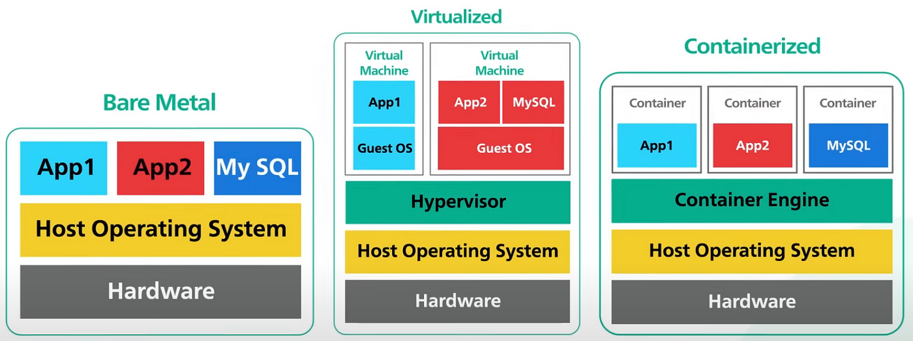
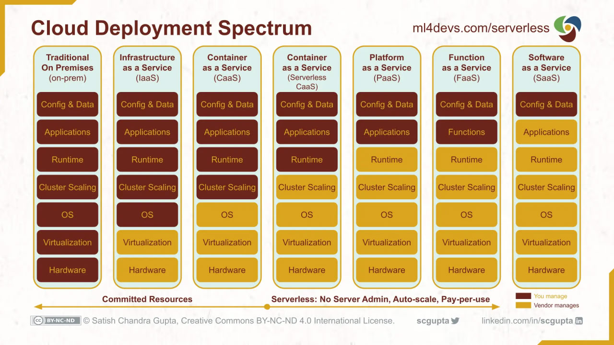

[comment]: # (THEME = sky)
[comment]: # (CODE_THEME = base16/zenburn)
[comment]: # (markdown: { smartypants: true })
[comment]: # (controls: false)
[comment]: # (keyboard: true)


### From Containers to Clusters
#### Exploring Docker & Beyond
----
Welcome to this Presentation!

[comment]: # (!!!)

### Table of Contents

- A Brief Overview
- Container History
- What is Docker
- How You can Create a Container Image
- What is Docker Compose
- What are Container Orchestrations

[comment]: # (!!!)

## A Brief Overview

[comment]: # (!!!)

### Who Am I?

- **Mostafa Bayat**
- Bachelor's degree from the University of Tehran
- Four Years as a DevOps Engineer at Tapsell
    - More than One Year as A Technical Lead
- https://www.linkedin.com/in/mostafa-bayat/

[comment]: # (!!!)

The palest ink is better than the best memory!
Note: 
- Chinese proverb
- Writing everything is very important
- Everything must be code and introduced through version control

[comment]: # (|||)

```sh [1-2]
git clone https://github.com/mostafabayat/docker-presentation
cd docker-presentation
```
Note: 
- Please pull and be active!

[comment]: # (!!!)

### Concepts
-------
Why do we need containers and container orchestration?

[comment]: # (|||)

### Deployment History,
#### From baremetals to Serverless


Note:
baremetal:
- Performance impact by neighbours
- security
- hard management (e.g. high boot time, needs to know many things from hardware to application)
- not scalable easily
VM:
- Hipervisor virtualizes hardware (drivers are critical!!!)
Container:
- Container Engine virtualizes the operating system (OS)
- Containers share the same OS kernel
- Very lightweight
Serverless:
- Serverless virtualizes the runtime environment.

- https://blog.equinix.com/blog/2020/02/25/how-to-speak-like-a-data-center-geek-bare-metal-vs-virtualization-vs-serverless

[comment]: # (|||)

### Who are Devops engineers? SRE? Cloud Engineer? SysAdmin?

Note:
- Who are Devops engineers?
- All of these men are responsible for make an application accessible to the client.
- https://medium.com/@telesis/devops-sre-the-main-difference-678131b4081c

[comment]: # (|||)

### XaaS 


Note:
- https://www.ml4devs.com/articles/serverless-architecture-for-microservices-on-aws-vs-google-cloud-vs-azure-as-iaas-caas-paas-faas/

[comment]: # (!!!)

[comment]: # (!!!)
